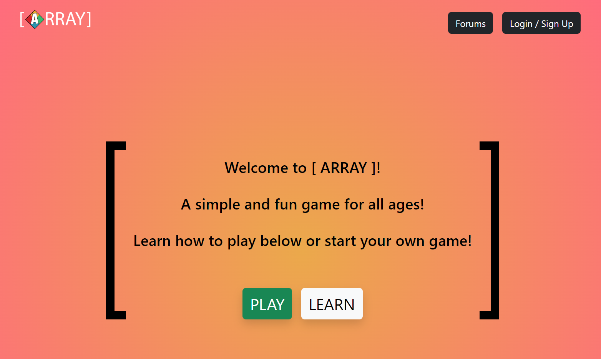
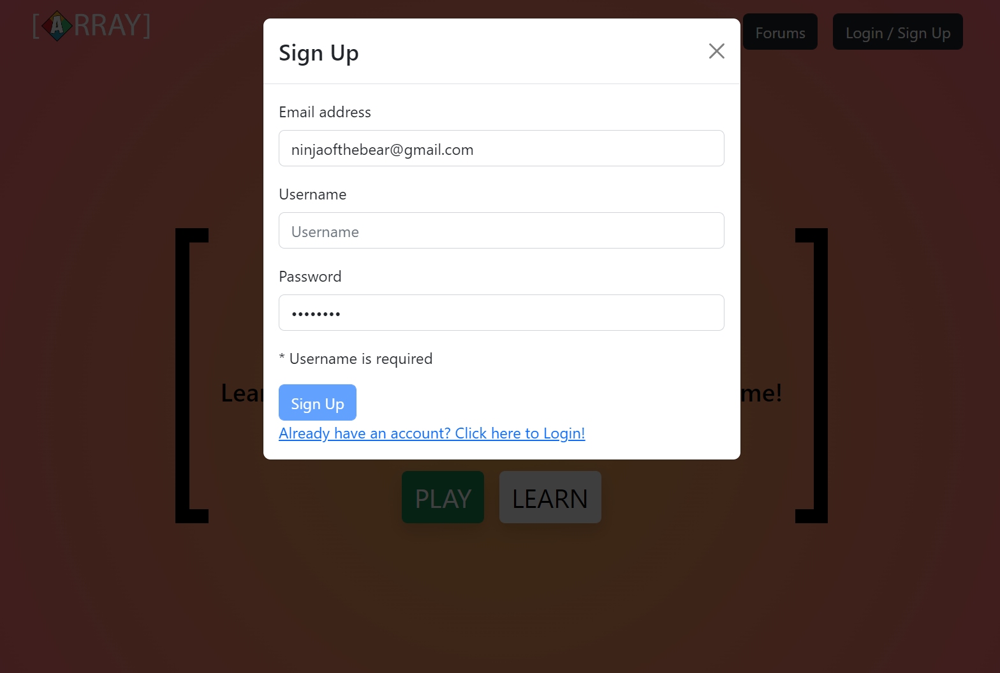

# Array the Game

[](https://opensource.org/licenses/MIT)

## Description

Our group is passionate about games, the experiences they provide, and the connections and friendships they foster. Array the game takes a board game and makes it playabale with friends across the world.

## User Story

```md
AS A user who is looking for something to do
I WANT a social website to play games with my friends
SO THAT I can have fun
```

## Table of Contents

1. [Description](#description)
2. [Usage](#usage)
3. [Contributing](#contributing)
4. [Questions](#questions)
5. [License](#license)

## Usage

[Deployed App](https://array-the-game-production.up.railway.app/)

[Main Repo](https://github.com/mmelan000/Array-the-Game)






## Contributors

- [@Michael Melanson](https://github.com/mmelan000)
- [@John Rizzuto](https://github.com/Zoot83)
- [@Alvin Pollard](https://github.com/alvinkp)

## Contributing

Follow best practices for naming conventions, indentation, quality comments, etc.

## Questions

If you have any questions, please reach out to us either on Github or by Email.

- [m.melanson000@gmail.com](mailto:m.melanson000@gmail.com)
- [alvinkpollard@gmail.com](mailto:alvinkpollard@gmail.com)
- [marshallrizzuto@gmail.com](mailto:marshallrizzuto@gmail.com)

## License

- [MIT](https://opensource.org/licenses/MIT)
